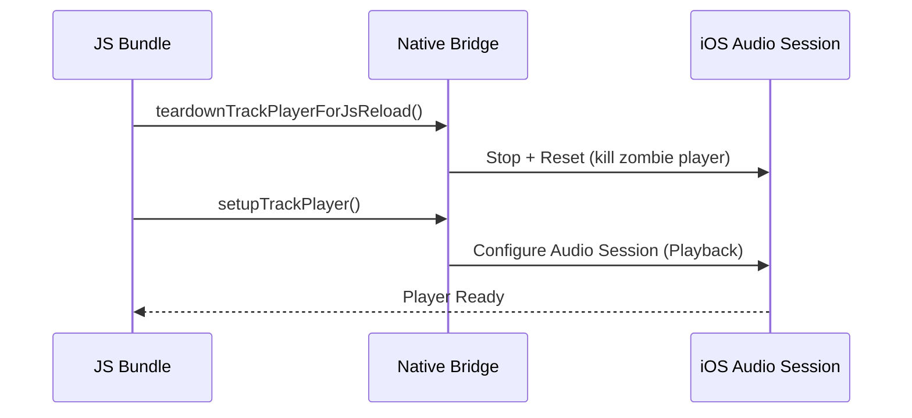
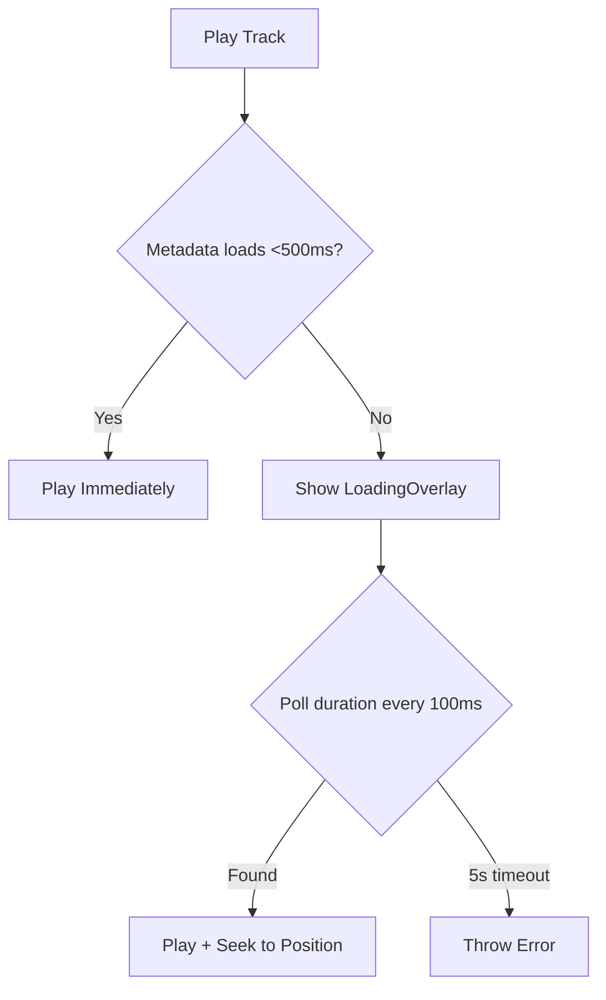
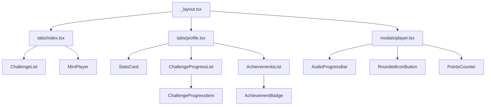

# Music Rewards Mini App - Architecture

## Overview
Expo Router + React Native app for music challenge rewards. Users complete listening challenges to earn points. Built with Expo 54, Zustand, react-native-track-player.

---

## Directory Structure
```
src/
├── app/                                   # Expo Router screens
│   ├── _layout.tsx                        # Root layout (PlayerPersistence, LoadingOverlay)
│   ├── (tabs)/
│   │   ├── index.tsx                      # Home screen (ChallengeList)
│   │   ├── profile.tsx                    # User progress + stats
│   │   └── _layout.tsx
│   └── (modals)/
│       ├── player.tsx                     # Full-screen player (UI)
│       └── _layout.tsx                    # Modal config ("Now Playing")
│
├── components/                            # Reusable + feature components
│   ├── ui/                                # Reusable UI components
│   │   ├── GlassCard.tsx                  # Glassmorphism card
│   │   ├── GlassButton.tsx                # Glassmorphism button
│   │   ├── RoundedIconButton.tsx          # Circular icon button
│   │   ├── AudioProgressBar.tsx           # Reusable progress bar
│   │   ├── MiniPlayer.tsx                 # Bottom bar (playing state)
│   │   ├── LoadingOverlay.tsx             # Global loading overlay
│   │   ├── AchievementBadge.tsx           # Achievement badge (reusable)
│   │   └── *.styles.tsx                   # Style files
│   ├── challenge/                         # Challenge-specific components
│   │   ├── ChallengeCard.tsx
│   │   ├── ChallengeList.tsx
│   │   └── DifficultyBadge.tsx
│   └── profile/                           # Profile-specific components
│       ├── AchievementsList.tsx           # Data-driven achievements
│       └── ChallengeProgressList.tsx      # Reusable progress list
│
├── hooks/                                 # Business logic hooks
│   ├── useMusicPlayer.ts                  # Glue: TrackPlayer + Zustand
│   ├── usePlayerModal.ts                  # Player modal logic (handlers, state)
│   ├── useTrackPersistence.ts             # Progress sync + challenge completion
│   ├── usePointsCounter.ts                # Points calculation (reactive)
│   ├── useTrackPlayerInit.ts              # Player init + teardown
│   └── useChallenges.ts                   # Challenge data loading
│
├── services/                              # Singleton services (no React hooks)
│   ├── PlaybackOrchestrator.ts            # Playback orchestration (singleton)
│   ├── audioService.ts                    # TrackPlayer setup, addTrack, lock screen
│   └── playbackService.ts                 # Headless service (remote events)
│
├── stores/                                # Zustand state management
│   ├── musicStore.ts                      # Player state (currentTrack, isPlaying)
│   └── userStore.ts                       # User data (progress, points, challenges)
│
├── types/                                 # TypeScript type definitions
│   ├── index.ts                           # Global types
│   ├── achievement.ts                     # Achievement types
│   └── musicChallenge.ts                  # Challenge type
│
├── constants/                             # Centralized data
│   ├── theme.ts                           # Design tokens (colors, spacing)
│   ├── icons.ts                           # Centralized icon imports
│   ├── achievements.ts                    # Achievement definitions (data-driven)
│   ├── challenges.ts                      # Sample challenge data
│   └── profileConstants.ts                # Profile-related constants
│
└── utils/                                 # Pure utility functions
    ├── pointsCalculator.ts                # Points math
    └── timeFormat.ts                      # Duration formatting
```

---

## Design Decisions

### 1. Single Responsibility Principle (SRP)
- `useMusicPlayer.ts`: 267→65 lines (glue only)
- `PlaybackOrchestrator.ts`: Singleton service (no hooks)
- `useTrackPersistence.ts`: Global progress sync + completion
- `usePointsCounter.ts`: Reactive points calculation

### 2. Container/Presenter Pattern
- `player.tsx` (UI) + `usePlayerModal.ts` (logic)
- `profile.tsx` (UI) + `AchievementsList.tsx` (data-driven)
- `ChallengeProgressList.tsx` (reusable across screens)

### 3. Data-Driven Architecture
- Achievements: `constants/achievements.ts` (add achievement = add 1 object)
- `AchievementBadge.tsx`: Reusable across app
- No hardcoded UI conditionals

### 4. Centralized Resources
- `constants/icons.ts`: All icon imports (avoid require() in components)
- `constants/theme.ts`: Design tokens (colors, spacing, fonts)
- `assets.d.ts`: TypeScript declarations for images

---

## Audio Resilience & System Integration

### Background Audio
App leverages `react-native-track-player` as background service.
- **Persistence:** Audio continues when app minimized or screen locked.
- **Capabilities:** Requires `audio` background mode in iOS (`app.json`).
- **iOS Category:** `Playback` with `AllowBluetooth`, `AllowAirPlay`, `MixWithOthers`.

### Initialization Flow


### Interruption Management
`playbackService.ts` handles hardware-level events (registered in `index.js`):
- **Remote Play/Pause:** Lock screen controls
- **Remote Duck:** Auto-lowers volume for system sounds (navigation, notifications)
- **Remote Stop:** Full pause when phone call received
- **PlaybackQueueEnded:** Handle track finish
- **PlaybackError:** Log and recover

### Hybrid Loading Strategy


**Why?** Fast-path avoids flash of loading. Slow-path protects UX when network slow.

---

## Component Hierarchy


---

## State Management

### `musicStore.ts` (Player State)
- `currentTrack: MusicChallenge | null`
- `isPlaying: boolean`
- `challenges: MusicChallenge[]` (persisted)

### `userStore.ts` (User Data)
- `completedChallenges: string[]` (persisted)
- `listenedTimeMap: Record<string, number>` (max seconds listened)
- `awardedChallenges: Record<string, number>` (points awarded)

### Selector Pattern
```typescript
// Performance: avoid re-renders
export const selectCurrentTrack = (state: MusicStore) => state.currentTrack;
export const selectCompletedChallenges = (state: UserStore) => state.completedChallenges;
```

---

## Performance Optimizations

### 1. Throttled Progress Sync
```typescript
// Every 5 seconds, not every 1ms progress tick
const SYNC_INTERVAL = 5;
if (seconds - lastSyncedRef.current >= SYNC_INTERVAL) {
  updateMaxListenedTime(trackId, position);
}
```

### 2. Memoized Computations
```typescript
const progress = useMemo(() => {
  if (!duration) return 0;
  return (position / duration) * 100;
}, [position, duration]);
```

### 3. Zombie Player Prevention
```typescript
// Kill ghost player on JS reload
export const teardownTrackPlayerForJsReload = async () => {
  await ensureTrackPlayerInitialized();
  await TrackPlayer.pause();
  await TrackPlayer.reset();
};
```

---

## Key Libraries
- **Expo Router:** File-based routing (tabs + modals)
- **Zustand:** Lightweight state management with persistence
- **react-native-track-player:** Background audio + lock screen controls
- **expo-blur:** Glassmorphism effects (expo-blur)
- **AsyncStorage:** Persistent storage backend

---

## iOS Configuration (app.json)
```json
{
  "ios": {
    "backgroundModes": ["audio"],
    "infoPlist": {
      "UIBackgroundModes": ["audio"]
    }
  }
}
```

**Critical:** Without `backgroundModes: ["audio"]`, iOS kills audio when app backgrounds.
