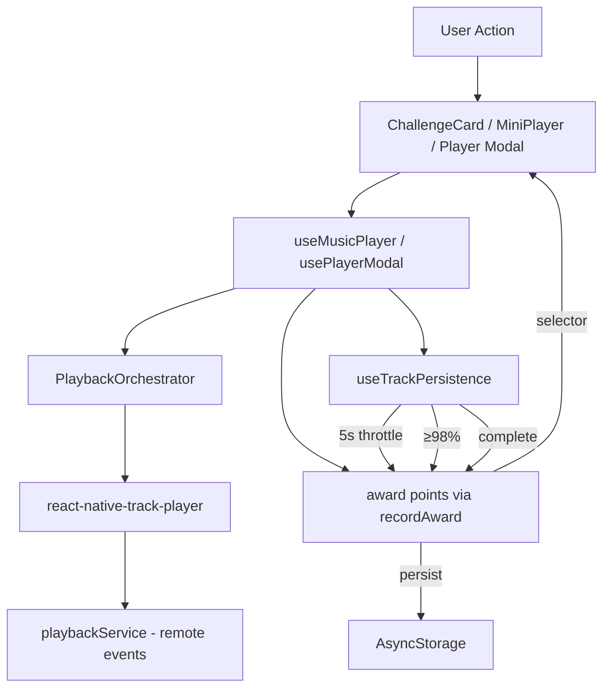
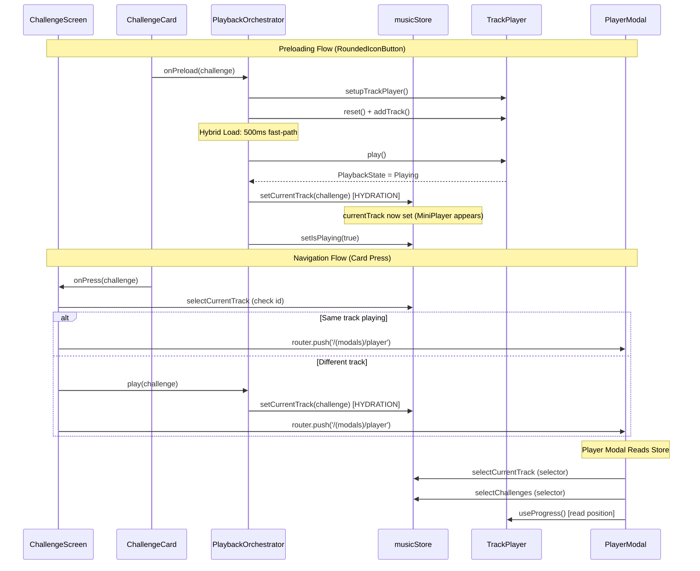
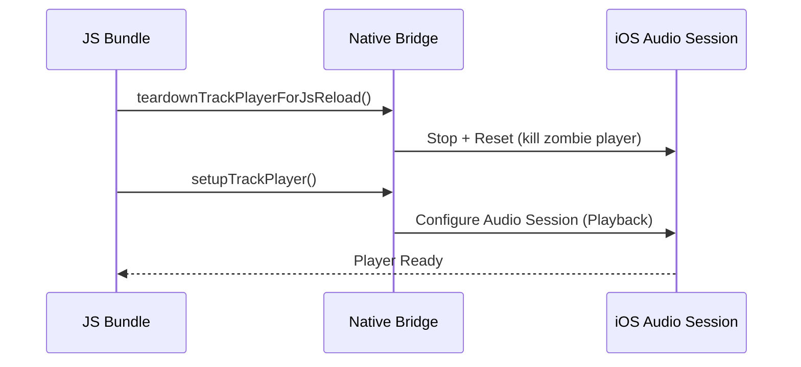
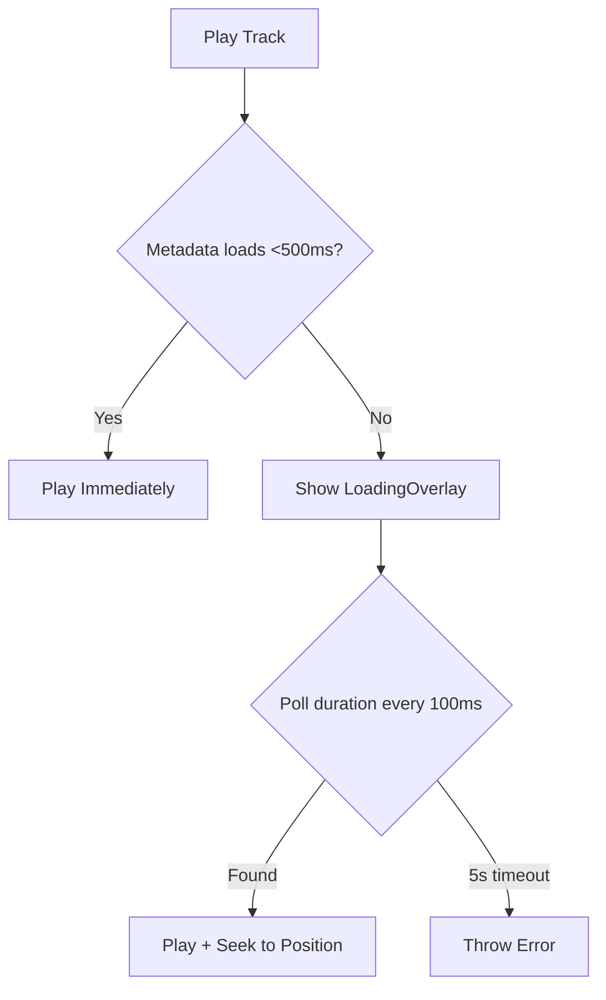
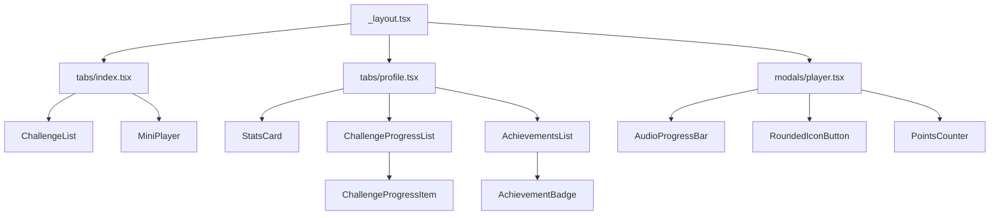
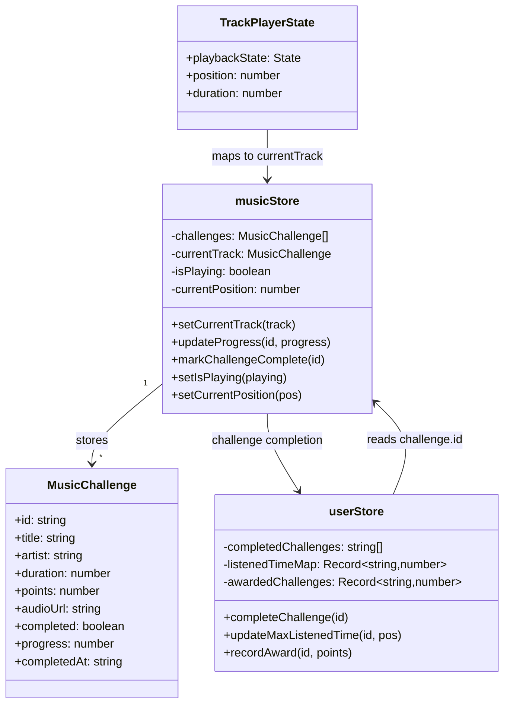
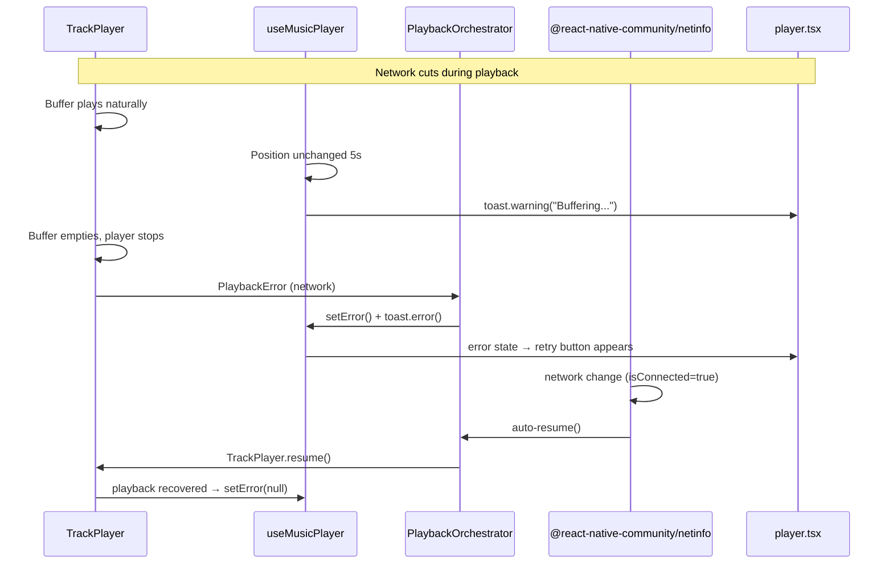
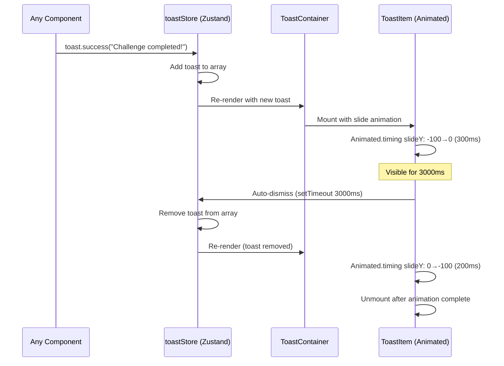

# Music Rewards Mini App - Architecture

## Overview
Expo Router + React Native app for music challenge rewards. Users complete listening challenges to earn points. Built with Expo 54, Zustand, react-native-track-player.

---

## Directory Structure
```
src/
├── app/                                   # Expo Router screens & layouts
│   ├── (tabs)/                             # Tab navigation screens
│   └── (modals)/                           # Modal screens
│
├── components/                            # Reusable + feature components
│   ├── ui/                                # Reusable UI components (GlassCard, RoundedIconButton, etc.)
│   ├── challenge/                         # Challenge-specific components (ChallengeCard, ChallengeList, etc.)
│   └── profile/                           # Profile-specific components (AchievementsList, etc.)
│
├── hooks/                                 # Business logic hooks
│
├── services/                              # Singleton services (no React hooks)
│
├── stores/                                # Zustand state management
│
├── types/                                 # TypeScript type definitions
│
├── constants/                             # Centralized data (theme, icons, achievements, etc.)
│
└── utils/                                 # Pure utility functions

---

## Design Decisions

### 1. Single Responsibility Principle (SRP)
- `useMusicPlayer.ts`: Thin glue hook (65 lines) - bridges TrackPlayer hooks ↔ store + error handling
- `PlaybackOrchestrator.ts`: Singleton service (no hooks) - playback orchestration, network listener, track lifecycle
- `useTrackPersistence.ts`: Progress sync (5s throttle) + challenge completion (98% threshold)
- `usePlayerModal.ts`: Player modal logic - seek, drag, play/pause, restart, progress calculation
- `useTrackPlayerInit.ts`: Init + teardown - kills zombie player on JS reload

### 2. Container/Presenter Pattern
- `player.tsx` (UI) + `usePlayerModal.ts` (logic)
- `profile.tsx` (UI) + `AchievementsList.tsx` (data-driven)
- `ChallengeProgressList.tsx` (reusable across screens)

### 3. Data-Driven Architecture
- Achievements: `constants/achievements.ts` (add achievement = add 1 object)
- `AchievementBadge.tsx`: Reusable across app
- No hardcoded UI conditionals

### 4. Centralized Resources
- `constants/icons.ts`: All icon imports (avoid require() in components)
- `constants/theme.ts`: Design tokens (colors, spacing, fonts)
- `assets.d.ts`: TypeScript declarations for images

---

## Business Logic Analysis

### Hooks (`src/hooks/`)

**useMusicPlayer.ts**
- Glue layer: TrackPlayer hooks → store sync, error handling, buffering detection
- Dependencies: `react-native-track-player`, `PlaybackOrchestrator`, `musicStore`
- Returns: `play`, `pause`, `resume`, `seekTo`, `retry`, `isBuffering`, `error`

**usePlayerModal.ts**
- Player modal state: seek, drag, play/pause, restart, progress calculation
- Dependencies: `useMusicPlayer`, `musicStore`, `userStore`
- Returns: `progress`, `challengeProgress`, `displayChallenge`, `isCompleted`, handlers

**useTrackPersistence.ts**
- Progress sync (5s throttle) → `listenedTimeMap`
- Challenge completion check (≥98%) → `markChallengeComplete` + `completeChallenge` + award points
- Dependencies: `react-native-track-player`, `musicStore`, `userStore`

**useTrackPlayerInit.ts**
- Init TrackPlayer + teardown zombie player on JS reload
- Dependencies: `audioService`, `playbackService`

**Flow:**
```
useTrackPlayerInit (mount)
  ↓
useMusicPlayer (play/pause/resume + error handling)
  ↓
useTrackPersistence (progress sync every 5s → listenedTimeMap)
  ↓
useTrackPersistence (completion check ≥98% → markComplete + award points)
```

---

### Lifecycle Flowchart

```mermaid
flowchart TD
    subgraph Mounting["1. Mounting"]
        A[App Launch] --> B[useTrackPlayerInit]
        B --> C[teardownTrackPlayerForJsReload]
        C --> D[setupTrackPlayer]
        D --> E[TrackPlayer Ready]
    end

    subgraph ProgressSync["2. Progress Sync (5s throttle)"]
        F[TrackPlayer.getProgress] --> G{position > 0?}
        G -->|Yes| H[useTrackPersistence]
        H --> I{seconds - lastSynced >= 5?}
        I -->|Yes| J[updateMaxListenedTime(id, position)]
        J --> K[musicStore: updateProgress(id, progress%)]
        I -->|No| L[Skip update]
    end

    subgraph Persistence["3. Persistence (Zustand persist middleware)"]
        M[musicStore changes] --> N{partialize filter}
        N -->|challenges only| O[AsyncStorage: 'music-store']
        P[userStore changes] --> Q{partialize filter}
        Q -->|completedChallenges, listenedTimeMap, awardedChallenges| R[AsyncStorage: 'user-store']
    end

    Mounting --> ProgressSync
    ProgressSync --> Persistence
```

### Services (`src/services/`)

**PlaybackOrchestrator.ts** (Singleton)
- `play(track)`: Save prev progress → reset → addTrack → hybrid duration load (500ms fast-path) → waitForPlaybackStart (8s timeout)
- `resume()`: Check if finished (≥98%) → seekTo(0) or play
- `pause()`: TrackPlayer.pause()
- `_startNetworkListener()`: NetInfo listener → auto-resume on reconnect, remount on network return

**audioService.ts** (Utilities)
- TrackPlayer setup (iOS category: Playback, AllowBluetooth, AllowAirPlay)
- `addTrack()`: URL validation + add to queue
- `updateLockScreenControls()`: Sync capabilities with completion state

**playbackService.ts** (Headless)
- Remote events: Play/Pause, Duck, Stop, PlaybackQueueEnded, PlaybackError
- Registered at module level in `useTrackPlayerInit.ts`

### Stores (`src/stores/`)

**musicStore.ts** (Persisted: `challenges[]`)
- State: `currentTrack`, `isPlaying`, `challenges[]`
- Actions: `setCurrentTrack`, `setIsPlaying`, `updateProgress`, `markChallengeComplete`
- Note: Does NOT persist playback state (`currentTrack`, `isPlaying`)

**userStore.ts** (Persisted: `completedChallenges`, `listenedTimeMap`, `awardedChallenges`)
- State: `completedChallenges[]`, `listenedTimeMap{}`, `awardedChallenges{}`
- Actions: `completeChallenge`, `updateMaxListenedTime`, `recordAward`
- Note: Does NOT persist derived `totalPoints` (calculated from `awardedChallenges`)

**toastStore.ts** (Not persisted)
- State: `toasts[]`
- Actions: `showToast`, `dismissToast`

**loadingStore.ts** (Not persisted)
- State: `visible`, `message`
- Actions: `showLoading`, `hideLoading`

### Utils (`src/utils/`)

**toast.ts**
- Helper: `toast.success/warning/error` → calls `toastStore.showToast()`

**urlAudioValidator.ts**
- HEAD request with 2s timeout → validates audio URL before playback

**challengeHelpers.ts**
- Pure functions: `formatDuration()`, `getButtonTitle()`

**timeFormat.ts**
- Duration formatting (seconds → mm:ss)

**pointsCalculator.ts**
- Points math (deprecated, now in `usePointsCounter.ts`)

---

### Data Structure Example (API Contract)

**JSON representation of stores when 2 challenges are active:**

```json
{
  "musicStore": {
    "challenges": [
      {
        "id": "challenge-1",
        "title": "Summer Vibes",
        "artist": "DJ Sunshine",
        "duration": 180,
        "points": 100,
        "audioUrl": "https://example.com/track1.mp3",
        "completed": false,
        "progress": 45.5,
        "completedAt": null
      },
      {
        "id": "challenge-2",
        "title": "Night Drive",
        "artist": "Synthwave Co",
        "duration": 240,
        "points": 150,
        "audioUrl": "https://example.com/track2.mp3",
        "completed": true,
        "progress": 100,
        "completedAt": "2026-05-06T10:30:00Z"
      }
    ],
    "currentTrack": {
      "id": "challenge-1",
      "title": "Summer Vibes",
      "artist": "DJ Sunshine",
      "duration": 180,
      "points": 100,
      "audioUrl": "https://example.com/track1.mp3",
      "completed": false,
      "progress": 45.5
    },
    "isPlaying": true,
    "currentPosition": 81.5
  },
  "userStore": {
    "completedChallenges": ["challenge-2"],
    "listenedTimeMap": {
      "challenge-1": 81.5,
      "challenge-2": 240
    },
    "awardedChallenges": {
      "challenge-2": 150
    }
  }
}
```

**API Contract Explanation:**

| Field | Source | Purpose |
|-------|--------|---------|
| `MusicChallenge` | `constants/challenges.ts` or API | Remote track data with `audioUrl`, `duration`, `points` |
| `listenedTimeMap` | `TrackPlayer.getProgress().position` | Local progress: `challengeId` → `maxSecondsListened` |
| `progress` (in store) | Calculated: `(listenedTime / duration) * 100` | 0-100% for UI display |
| `completed` | Set when `progress >= 98%` | Prevents re-awarding points |
| `awardedChallenges` | Set on completion | `challengeId` → `points` (prevents duplicate awards) |

**Flow:**
1. TrackPlayer plays → `useTrackPersistence` reads `position` every 5s
2. `updateMaxListenedTime(id, position)` → writes to `listenedTimeMap`
3. `updateProgress(id, (position/duration)*100)` → writes to `challenge.progress`
4. When `progress >= 98%` → `markChallengeComplete()` + `completeChallenge()` + `recordAward()`

---

## State Flow Diagram



---

## Prefetching & Mounting Sequence



**Key Insight:** Data is "hydrated" into `musicStore.currentTrack` BEFORE `router.push()` via `setCurrentTrack()`. This allows:
- MiniPlayer to appear immediately after preload button press
- Player Modal to read `currentTrack` from store upon mount (no loading flash)

---

## Audio Resilience & System Integration

### Background Audio
App leverages `react-native-track-player` as background service.
- **Persistence:** Audio continues when app minimized or screen locked.
- **Capabilities:** Requires `audio` background mode in iOS (`app.json`).
- **iOS Category:** `Playback` with `AllowBluetooth`, `AllowAirPlay`, `MixWithOthers`.

### Initialization Flow


### Interruption Management
`playbackService.ts` handles hardware-level events (registered in `index.js`):
- **Remote Play/Pause:** Lock screen controls
- **Remote Duck:** Auto-lowers volume for system sounds (navigation, notifications)
- **Remote Stop:** Full pause when phone call received
- **PlaybackQueueEnded:** Handle track finish
- **PlaybackError:** Log and recover

### Hybrid Loading Strategy


**Why?** Fast-path avoids flash of loading. Slow-path protects UX when network slow.

---

## Component Hierarchy


---

## State Management

### State Schema Diagram (classDiagram)



**Selectors (Read):**
- `selectCurrentTrack`: reads `musicStore.currentTrack`
- `selectChallenges`: reads `musicStore.challenges`
- `selectCompletedChallenges`: reads `userStore.completedChallenges`
- `selectListenedTimeMap`: reads `userStore.listenedTimeMap`

**Actions (Write):**
- `setCurrentTrack()`: writes `musicStore.currentTrack`
- `updateProgress()`: writes `musicStore.challenges[].progress`
- `markChallengeComplete()`: writes `musicStore.challenges[].completed`
- `completeChallenge()`: writes `userStore.completedChallenges[]`
- `updateMaxListenedTime()`: writes `userStore.listenedTimeMap`
- `recordAward()`: writes `userStore.awardedChallenges`

---

### `musicStore.ts` (Player State)
- `currentTrack: MusicChallenge | null`
- `isPlaying: boolean`
- `challenges: MusicChallenge[]` (persisted)

### `userStore.ts` (User Data)
- `completedChallenges: string[]` (persisted)
- `listenedTimeMap: Record<string, number>` (max seconds listened)
- `awardedChallenges: Record<string, number>` (points awarded)

### Selector Pattern
```typescript
// Performance: avoid re-renders
export const selectCurrentTrack = (state: MusicStore) => state.currentTrack;
export const selectCompletedChallenges = (state: UserStore) => state.completedChallenges;
```

---

## Performance Optimizations

### 1. Throttled Progress Sync
```typescript
// Every 5 seconds, not every 1ms progress tick
const SYNC_INTERVAL = 5;
if (seconds - lastSyncedRef.current >= SYNC_INTERVAL) {
  updateMaxListenedTime(trackId, position);
}
```

### 2. Memoized Computations
```typescript
const progress = useMemo(() => {
  if (!duration) return 0;
  return (position / duration) * 100;
}, [position, duration]);
```

### 3. Zombie Player Prevention
```typescript
// Kill ghost player on JS reload
export const teardownTrackPlayerForJsReload = async () => {
  await ensureTrackPlayerInitialized();
  await TrackPlayer.pause();
  await TrackPlayer.reset();
};
```

---

## Error Handling & Network Resilience

### Error Types & Toast Mapping
| Error Type | Toast Color | Trigger | Recovery |
|-----------|-------------|--------|----------|
| Track load failure | Red (error) | Bad URL / 8s timeout | Retry button |
| Network down (while playing) | Yellow (warning) | `PlaybackError` with network keywords | Auto-resume when network returns |
| Buffering (>5s stalled) | Yellow (warning) | Position stops advancing for 5s | Player continues from buffer, auto-clears when advances |
| Network down (player stopped) | Red (error) | `PlaybackError` + player not playing | Retry button, auto-resume |
| Challenge complete | Green (success) | Progress ≥98% | Auto-dismiss modal + toast |

### Current Implementation

**1. No auto-pause on network loss:**
- Player continues playing from buffer until naturally stops
- Only shows warning toasts, doesn't interrupt playback

**2. Buffering detection (`useMusicPlayer.ts`):**
```typescript
// Poll progress.position every 100ms
// If position unchanged for 5s → show "Buffering: Network may be slow"
const BUFFER_TIMEOUT_MS = 5000;

useEffect(() => {
  if (currentPos === lastPositionRef.current && currentPos > 0) {
    bufferTimerRef.current = setTimeout(() => {
      toast.warning('Buffering: Network may be slow');
      setIsBuffering(true);
    }, BUFFER_TIMEOUT_MS);
  } else {
    // Position changed → clear timer + clear error
    clearTimeout(bufferTimerRef.current);
    setError(null);
    setIsBuffering(false);
  }
}, [isPlayingValue, progress.position]);
```

**3. Network recovery auto-resume (`PlaybackOrchestrator.ts`):**
```typescript
_startNetworkListener(): void {
  NetInfo.addEventListener(state => {
    if (state.isConnected && state.isInternetReachable) {
      // Network returned → auto-resume if not playing
      TrackPlayer.getPlaybackState().then(state => {
        if (state.state !== State.Playing && currentTrackRef) {
          this.resume().catch(console.error);
        }
      });
    }
  });
}
```

**4. Error state + toast flow:**
```
Network cuts → buffer plays → toast.warning("Buffering: Network may be slow")
     ↓
Buffer empties → player stops naturally → PlaybackError fired
     ↓
If not playing: setError() + toast.error() + retry button appears
     ↓
Network returns → NetInfo listener → auto-resume()
     ↓
Playback recovers → setError(null) + setIsBuffering(false)
```

### Fast Failure for Track Load
```typescript
// _waitForPlaybackStart(): Fail after 8s (5s load + 2s buffer + 1s margin)
async _waitForPlaybackStart(timeout: number): Promise<void> {
  const start = Date.now();
  while (Date.now() - start < timeout) {
    const state = await TrackPlayer.getPlaybackState();
    if (state.state === State.Playing) return;
    await new Promise(r => setTimeout(r, 100));
  }
  throw new Error('Track failed to start playback');
}
```

**Why 8s?** Loading overlay shows for 5s (duration poll), then 2s buffer for iOS to actually start playback.

### Network Interrupt Handling (Updated)


---

## Global Toast Notification System

### Toast Schema
```typescript
// src/types/toast.ts
export type ToastType = 'success' | 'warning' | 'error';

export interface Toast {
  id: string;
  message: string;
  type: ToastType;
  createdAt: number;
}
```

### Toast Colors (from theme.ts)
```typescript
toast: {
  success: '#22C55E', // green-500 (challenge completed)
  warning: '#EAB308', // yellow-500 (buffering, retry)
  error: '#EF4444',   // red-500 (network error, playback failure)
}
```

### Toast Flow Diagram


### Toast diagram

┌─────────────────────────────────────────┐
│         RootLayout (_layout.tsx)        │
│                                         │
│  ┌─────────────────────────────────┐    │
│  │      ToastProvider (Global)     │    │
│  │  - Mounts ToastContainer        │    │
│  │  - Provides toast() function    │    │
│  └─────────────────────────────────┘    │
│                                         │
│  ┌─────────────────────────────────┐    │
│  │      LoadingOverlay (Existing)  │    │
│  └─────────────────────────────────┘    │
│                                         │
│  ┌─────────────────────────────────┐    │
│  │         App Stack / Tabs        │    │
│  └─────────────────────────────────┘    │
└─────────────────────────────────────────┘

ToastStore (Zustand)
├── toasts: Toast[]
├── showToast(message, type) 
├── dismissToast(id)
└── autoDismiss after 3s


### Toast Usage
```typescript
import { toast } from '../utils/toast';

// Success (green) - Challenge completed
toast.success('Challenge completed successfully!');

// Warning (yellow) - Recoverable issues
toast.warning('Retrying playback...');
toast.warning('Buffering...');

// Error (red) - Network/playback failures
toast.error('Network error: Check your connection');
toast.error('Playback error: Unable to load track');
```

### Architecture
```
src/
├── types/toast.ts              # ToastType, Toast interfaces
├── stores/toastStore.ts        # Zustand store (global state)
├── components/ui/Toast.tsx     # Animated toast item (react-native-reanimated)
├── components/ui/ToastContainer.tsx  # Mounts in root layout
└── utils/toast.ts              # Helper: toast.success/warning/error
```

**Mounted in:** `src/app/_layout.tsx` (global scope, top of screen)

---

## Key Libraries
- **Expo Router:** File-based routing (tabs + modals)
- **Zustand:** Lightweight state management with persistence
- **react-native-track-player:** Background audio + lock screen controls
- **expo-blur:** Glassmorphism effects (expo-blur)
- **AsyncStorage:** Persistent storage backend

---

## iOS Configuration (app.json)
```json
{
  "ios": {
    "backgroundModes": ["audio"],
    "infoPlist": {
      "UIBackgroundModes": ["audio"]
    }
  }
}
```

**Critical:** Without `backgroundModes: ["audio"]`, iOS kills audio when app backgrounds.

---

## Implementation Summary

### ✅ Completed (BASIC)
- Proper Zustand store implementation with selectors
- Custom hooks for business logic separation
- Clean component composition
- Proper TypeScript typing throughout
- react-native-track-player integration
- Proper audio session management
- Glass design system with blur effects
- Smooth modal presentations
- Consistent spacing and typography
- Loading states and error handling
- Audio controls and progress visualization
- Points counter animation
- Audio playback with react-native-track-player
- Proper navigation patterns (Expo Router)
- Performance considerations (memoization, selectors)
- AsyncStorage persistence
- Background audio handling
- Audio interruption handling
- TypeScript best practices
- Component reusability
- Error boundaries and fallbacks
- Code organization and naming
- Proper cleanup and memory management

### 🚀 Completed (EXTRA)
- Background playback continuation
- Audio interruption handling (phone calls, notifications)
- Custom toast notifications system (success/warning/error)
- Gesture-based navigation (swipe to close modal)

---

## Planned for Next Iteration

### 🚀 Future Features
- Offline-first architecture
- State persistence with versioning/migrations
- Optimistic updates with rollback
- Real-time sync simulation
- Haptic feedback integration
- Dark/light theme toggle
- Audio visualization (waveform or spectrum)
- Crossfade between tracks
- Playlist support

